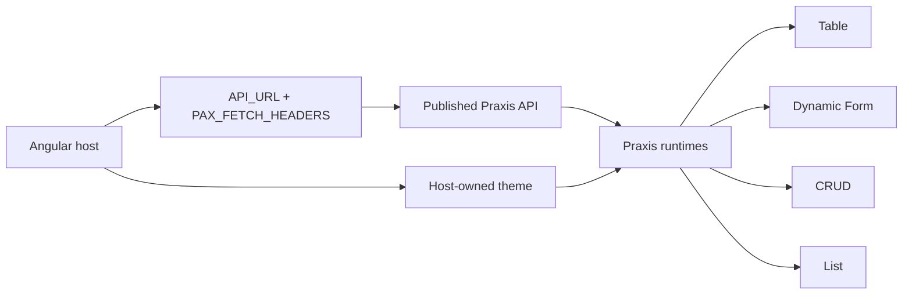

# Praxis UI Quickstart

Canonical Angular host for a first adoption path with PraxisUI.

[](https://angular.dev/)
[](https://praxisui.dev)
[](https://praxis-ui-4e602.web.app)
[](./package.json)

This repository is the shortest path from zero to a working PraxisUI host. It is not a broad showcase first. It is a focused adoption starter that proves the platform with four core runtimes over the same published backend resource.

## Related links

- [PraxisUI website](https://praxisui.dev)
- [Published quickstart API](https://praxis-api-quickstart.onrender.com/api)
- [Quickstart repository](https://github.com/codexrodrigues/praxis-ui-quickstart)
- [Live quickstart](https://praxis-ui-4e602.web.app)

## Canonical platform sources

- [praxis-metadata-starter](https://github.com/codexrodrigues/praxis-metadata-starter)
  Canonical source for metadata-driven semantics and the `x-ui` vocabulary consumed by the platform.

## Why this repository exists

Most teams do not need a bigger component catalog on day one. They need a host that:

- boots correctly with the Praxis runtime
- points to a real published API
- proves the same `resourcePath` across multiple runtimes
- keeps theme, branding, and application ownership in the host

That is the purpose of this quickstart.

## What it proves

- Angular standalone host bootstrap
- `API_URL` pointing to the published `praxis-api-quickstart`
- `PAX_FETCH_HEADERS` carrying tenant and locale
- four core runtimes proving the same remote resource in real flows
- host-owned theme over a shared Praxis runtime

## Core adoption path

The main path of this quickstart is intentionally narrow:

1. `praxis-table`
2. `praxis-dynamic-form`
3. `praxis-crud`
4. `praxis-list`

These four examples are the canonical first reading. Advanced examples remain available, but they are not the primary adoption path.

## First 10 minutes

1. Install dependencies.
2. Start the Angular host on `127.0.0.1:4301`.
3. Confirm the host points to the published API.
4. Open `Table`, `Form`, `CRUD`, and `List`.
5. Verify that all four surfaces reuse the same `resourcePath`.
6. Change the host theme and confirm the runtime follows it.

## Quick start

```bash
npm install
npm start
```

Open:

- `http://127.0.0.1:4301`

## How it works



## Public API mode

- origin: `https://praxis-api-quickstart.onrender.com`
- base URL: `https://praxis-api-quickstart.onrender.com/api`
- local app URL: `http://127.0.0.1:4301`

`127.0.0.1:4301` is already allowed in CORS for this published API.

## External adopters

This quickstart consumes published `@praxisui/*` packages from npm. You do not need access to the PraxisUI source workspace or any internal library build orchestration to get started with this host.

## Canonical host decisions

This quickstart is opinionated on purpose.

- `API_URL` already includes `/api`
- examples use relative `resourcePath`
- the host registers `provideHttpClient(...)`, Praxis providers, and runtime defaults
- tenant and locale flow through `PAX_FETCH_HEADERS`
- the same backend surface is reused across table, form, CRUD, and list

This keeps the first integration aligned with the platform instead of improvising local shortcuts.

## The host owns the theme

Praxis provides runtime behavior, metadata interpretation, and governed customization. The host keeps ownership of:

- colors and design tokens
- typography
- spacing and density
- company branding
- application composition

Adopting PraxisUI does not require accepting a proprietary visual skin. The quickstart explicitly proves that the host can switch themes while Praxis runtimes continue to work on the same operational surface.

## Core examples

### Praxis Table

Use it first to prove the canonical runtime path against a real published collection.

```html
<praxis-table
  tableId="quickstart-table"
  [resourcePath]="'human-resources/funcionarios'">
</praxis-table>
```

### Praxis Dynamic Form

Use it to confirm metadata-driven create flows on the same resource.

```html
<praxis-dynamic-form
  [formId]="'quickstart-funcionarios'"
  [resourcePath]="'human-resources/funcionarios'"
  [mode]="'create'">
</praxis-dynamic-form>
```

### Praxis CRUD

Use it to connect table and form behavior inside a governed CRUD runtime.

```html
<praxis-crud
  [crudId]="'quickstart-crud'"
  [metadata]="crudMetadata">
</praxis-crud>
```

### Praxis List

Use it to prove that the same published collection can be resolved by a different runtime reading.

```html
<praxis-list
  listId="quickstart-list"
  [config]="listConfig">
</praxis-list>
```

## Advanced examples

The repository also includes:

- `manual-form`
- `tabs`
- `stepper`
- `expansion`

These examples are useful once the core host path is already clear. They should not replace the first adoption flow.

## Why the install is broader than the first examples

The first reading path is narrower than the full dependency graph. Some `@praxisui/*` packages bring peer dependencies that support the runtime ecosystem even when the first examples do not expose every capability in the top navigation.

That is expected. The adoption path stays focused even when the package graph is broader.

## Project structure

- `src/app/app.config.ts`
  Canonical host bootstrap, `API_URL`, and headers factory.
- `src/app/app.routes.ts`
  Core and advanced example routes.
- `src/app/quickstart-content.ts`
  Setup steps, snippets, constants, and example catalog.
- `src/app/pages/home-page.component.ts`
  Onboarding home for the quickstart path.
- `src/app/app.html`
  Shell and top navigation.
- `src/styles.scss`
  Host-owned theme bridge.

## Validation

Useful local gates:

```bash
npm run build
npm run test:smoke
```

What these validate:

- production build of the Angular host
- smoke coverage for routes, shell, theme switcher, and onboarding path

## Deployment

The repository already contains Firebase Hosting configuration:

- project mapping in `.firebaserc`
- hosting config in `firebase.json`
- publish target: `dist/praxis-ui-quickstart/browser`

Typical release flow:

```bash
npm run build
firebase deploy --only hosting
```

## Troubleshooting

### The remote API does not answer

Confirm that:

- the host is running at `127.0.0.1:4301`
- the published API is reachable
- `API_URL` still points to `https://praxis-api-quickstart.onrender.com/api`

### The theme changes in the shell but not in overlays

The host theme must reach the global overlay boundary, not only the visible page shell. This quickstart already handles that at the app level.

### The first install feels broader than expected

That is normal for the current PraxisUI beta graph. Start with the core path and ignore advanced examples until the host integration is proven.

## Positioning

PraxisUI is not presented here as a generic widget library. This quickstart demonstrates a governed metadata-driven UI runtime for enterprise applications, hosted by Angular and aligned with a real backend surface.
