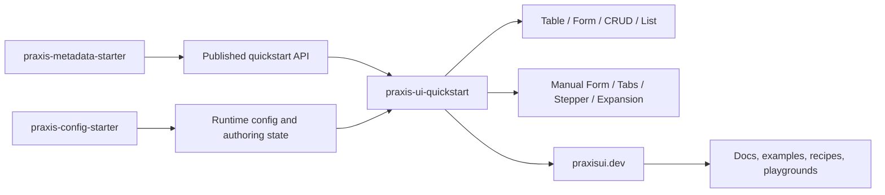
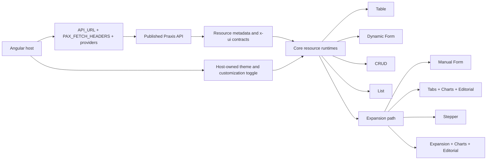

# Praxis UI Quickstart

Canonical Angular host for a first adoption path with PraxisUI.

[](https://angular.dev/)
[](https://praxisui.dev)
[](https://praxis-ui-4e602.web.app)
[](./package.json)

This repository is the shortest path from zero to a working PraxisUI Angular host. It is the installable proof that a host can bootstrap PraxisUI, call the published API, pass tenant and locale headers, keep visual ownership, and render metadata-driven runtimes without local shortcuts.

It is not the full component catalog and it is not the source of platform semantics. The quickstart proves the host path; [praxisui.dev](https://praxisui.dev) publishes the broader documentation and playgrounds; `praxis-metadata-starter` and `praxis-config-starter` own the backend and runtime contracts.

## Related links

- [PraxisUI website](https://praxisui.dev)
- [Published quickstart API](https://praxis-api-quickstart.onrender.com/api)
- [Quickstart repository](https://github.com/codexrodrigues/praxis-ui-quickstart)
- [Live quickstart](https://praxis-ui-4e602.web.app)
- [Official host contract](./docs/official-host-contract.md)
- [Production host provisioning](./docs/production-host-provisioning.md)
- [Machine-readable example inventory](./public/examples.manifest.json)

## Canonical platform sources

- [praxis-metadata-starter](https://github.com/codexrodrigues/praxis-metadata-starter)
  Canonical source for metadata-driven semantics and the `x-ui` vocabulary consumed by the platform.
- [praxis-config-starter](https://github.com/codexrodrigues/praxis-config-starter)
  Canonical source for runtime configuration, authoring state, AI registry, templates, headers, and ETag behavior.

## Role in the Praxis ecosystem

Use this repository when you need to verify that an Angular application can consume the public Praxis stack correctly.


```mermaid
flowchart LR
  metadata["praxis-metadata-starter"] --> api["Published quickstart API"]
  config["praxis-config-starter"] --> runtimeConfig["Runtime config and authoring state"]
  api --> quickstart["praxis-ui-quickstart"]
  runtimeConfig --> quickstart
  quickstart --> core["Table / Form / CRUD / List"]
  quickstart --> composition["Manual Form / Tabs / Stepper / Expansion"]
  quickstart --> docs["praxisui.dev"]
  docs --> playgrounds["Docs, examples, recipes, playgrounds"]
```

The ownership boundary is intentional:

- `praxis-ui-quickstart` proves the host integration path.
- `praxisui.dev` explains the broader product surface.
- `praxis-metadata-starter` owns resource semantics, `x-ui`, schemas, actions, and capabilities.
- `praxis-config-starter` owns runtime configuration and authoring persistence.
- `praxis-ui-angular` owns the public Angular runtime packages.

## Why this repository exists

Most teams do not need a bigger component catalog on day one. They need a host that:

- boots correctly with the Praxis runtime
- points to a real published API
- proves the same `resourcePath` across multiple runtimes
- keeps theme, branding, and application ownership in the host

That is the purpose of this quickstart.

The published backend behind this host already exposes broader public domains such as `operations`, `assets`, and `risk-intelligence`, but this Angular quickstart intentionally keeps the first adoption path narrower. Its job is to prove the canonical path with one stable resource before expanding into additional domains.

## What it proves

- Angular standalone host bootstrap
- `API_URL` pointing to the published `praxis-api-quickstart`
- `PAX_FETCH_HEADERS` carrying tenant and locale
- Angular 21 compatible PraxisUI package train pinned to `9.0.19`
- four core runtimes proving the same remote resource in real flows
- four expansion examples for manual layout, tabs, stepper, and expansion panels
- charts and editorial runtime embedded inside composition examples
- runtime customization toggled from the host shell
- host-owned theme over a shared Praxis runtime
- compatibility with a backend that already publishes additional domains beyond the first quickstart path

## Reading path

The quickstart has two layers.

The first layer is intentionally narrow:

1. `praxis-table`
2. `praxis-dynamic-form`
3. `praxis-crud`
4. `praxis-list`

These four examples are the canonical first reading because they prove the same published `resourcePath` through multiple resource runtimes.

The second layer shows where the current libraries go next:

1. `praxis-manual-form`
2. `praxis-tabs`
3. `praxis-stepper`
4. `praxis-expansion`
5. `praxis-charts` embedded in tabs and expansion panels
6. `praxis-editorial-forms` embedded as guided narrative blocks

Use this layer after the core path is clear. It is the expansion path, not a replacement for the first proof.

## Reactive Determinations: the complete form decision example

Open `/examples/reactive-determinations` after the basic Dynamic Form example.
It demonstrates two backend-owned decisions without placing business rules in
Angular:

- postal code determines address fields;
- gross pay and discounts determine net pay, then the authoritative net pay
  participates in determining the payment date.

The request schema publishes `x-ui.reactiveDeterminations`. It contains stable
operation IDs, trigger sources, input/output bindings, scope and provenance. It
does not publish executable formulas, arbitrary URLs, headers, callbacks or
frontend patch policies.

The example deliberately displays three different responsibilities:

1. `PraxisDynamicForm` executes the Metadata-compiled capability and owns the
   transient derived-field lifecycle.
2. The host observes `reactiveDeterminationExecuted` and
   `reactiveDeterminationPendingChange` only for UX and safe diagnostics.
3. `ReactiveDeterminationDiagnosticsComponent` explains the exact request
   schema and metadata-only events. It is read-only; changing a business
   decision belongs to governed Praxis Config authoring.

The live capability path is authenticated. The page probes `/auth/session`,
keeps both forms disabled while no business principal is present, and offers a
minimal Quickstart login that sends an HttpOnly session only to the configured
Praxis API origin. The public deployment does not publish credentials. In a
downloaded Quickstart, use the `admin` principal configured by the local API;
in a corporate host, replace the demo login with the organization's IdP/BFF.

The reference interceptor in `praxis-api-credentials.interceptor.ts` sets
`withCredentials` only when a request resolves to the `API_URL` origin. It does
not forward the session to third-party origins and it does not expose the JWT to
Angular code.

Submit remains blocked while a determination is pending or when its latest
generation did not produce an authoritative draft. Composed hosts such as
Stepper and CRUD must consume their aggregate stability outputs and must never
interpret “settled” alone as success.

The page fails closed if the published schema cannot be loaded. It never
installs a local fallback rule, which is the essential boundary for a reusable
enterprise host.

The page also separates the negative paths instead of presenting every failure
as a broken calculation: `401/403` means the host principal is missing or not
authorized, `422` means the backend could not determine the supplied source,
and `503` means the governed decision/snapshot is unavailable. These are
diagnostics; Angular still must not install a local formula as fallback.

## First 10 minutes

1. Install dependencies.
2. Start the Angular host on `127.0.0.1:4301`.
3. Confirm the host points to the published API.
4. Open `Table`, `Form`, `CRUD`, and `List`.
5. Verify that all four surfaces reuse the same `resourcePath`.
6. Open `Expansion` from the top navigation and inspect `Manual form`, `Tabs`, `Stepper`, and `Expansion`.
7. Toggle customization and change the host theme to confirm the runtime follows host-owned state.

## Quick start

```bash
npm install
npm start
```

Open:

- `http://127.0.0.1:4301`

### Dependency train

This project is intentionally pinned to the Angular 21 compatible PraxisUI train:

- Angular packages: `^21.x`
- PraxisUI packages: `9.0.19`

Keep the exact package train instead of replacing it with dist-tags or version ranges. Promote the host deliberately, validating the matching Angular peer range and the complete `@praxisui/*` dependency closure in the same change.

## Validate against local Praxis libs

Use this mode when the quickstart needs to validate unpublished changes from `../praxis-ui-angular/dist`.

```bash
npm run build:local-praxis
npm run start:local-praxis -- --host 127.0.0.1 --port 4301
```

What this does:

- generates `tsconfig.local-praxis.json`
- copies each required `@praxisui/*` dist package into `.local-praxis/node_modules/@praxisui/*`
- keeps Angular and shared peer dependencies resolved from the quickstart host itself
- starts the host on the same official validation origin: `http://127.0.0.1:4301`

Operational notes:

- build the libs in `../praxis-ui-angular/dist` first; `npm run watch-all` in `praxis-ui-angular` is the recommended source workflow
- prefer this mode over `npm link` package by package; the host owns the mapping and the Praxis workspace stays canonical
- `tsconfig.local-praxis.json` is generated and must not be versioned
- use `npm run build:local-praxis` when you need a production-style host build still pointing to local Praxis libs

## How it works


```mermaid
flowchart LR
  host["Angular host"] --> bootstrap["API_URL + PAX_FETCH_HEADERS + providers"]
  bootstrap --> api["Published Praxis API"]
  api --> metadata["Resource metadata and x-ui contracts"]
  metadata --> core["Core resource runtimes"]
  core --> table["Table"]
  core --> form["Dynamic Form"]
  core --> crud["CRUD"]
  core --> list["List"]
  host --> theme["Host-owned theme and customization toggle"]
  theme --> core
  core --> expansion["Expansion path"]
  expansion --> manual["Manual Form"]
  expansion --> tabs["Tabs + Charts + Editorial"]
  expansion --> stepper["Stepper"]
  expansion --> panels["Expansion + Charts + Editorial"]
```

## Public API mode

- origin: `https://praxis-api-quickstart.onrender.com`
- base URL: `https://praxis-api-quickstart.onrender.com/api`
- local app URL: `http://127.0.0.1:4301`

`127.0.0.1:4301` is already allowed in CORS for this published API.

## External adopters

This quickstart consumes published `@praxisui/*` packages from npm. You do not need access to the PraxisUI source workspace or any internal library build orchestration to get started with this host.

The package list is broader than the first screen because several runtimes expose peer packages for authoring, settings panels, metadata editing, rich content, dialogs, files upload, and visual builder integration. They are pinned in `package.json` so a fresh install resolves the Angular 21 compatible graph deterministically.

## Canonical host decisions

This quickstart is opinionated on purpose.

- `API_URL` already includes `/api`
- examples use relative `resourcePath`
- the host registers `provideHttpClient(...)`, Praxis providers, and runtime defaults
- tenant and locale flow through `PAX_FETCH_HEADERS`
- the same backend surface is reused across table, form, CRUD, and list
- the first path stays on `human-resources/funcionarios` even though the published backend also exposes `operations`, `assets`, and `risk-intelligence`

This keeps the first integration aligned with the platform instead of improvising local shortcuts.

## The host owns the theme

Praxis provides runtime behavior, metadata interpretation, and governed customization. The host keeps ownership of:

- colors and design tokens
- typography
- spacing and density
- company branding
- application composition

Adopting PraxisUI does not require accepting a proprietary visual skin. The quickstart explicitly proves that the host can switch themes while Praxis runtimes continue to work on the same operational surface.

The `Corporate` theme is intentionally more radical than a normal palette swap. It pushes darker gradients, larger radii, glass surfaces, and a more SaaS-like shell so teams can see that PraxisUI does not force an Angular-default visual language on the host.

## Core examples

### Praxis Table

Use it first to prove the canonical runtime path against a real published collection.

```html
<praxis-table
  tableId="quickstart-table"
  [resourcePath]="'human-resources/funcionarios'">
</praxis-table>
```

### Praxis Dynamic Form

Use it to confirm metadata-driven hydration for an existing employee profile.
The fixed `resourceId` below points to the seeded demo record used by the
quickstart; replace it with the selected row, route param, or host state in a
real application. For create flows, omit `resourceId` and use `mode="create"`.

```html
<praxis-dynamic-form
  [formId]="'quickstart-funcionarios'"
  [resourcePath]="'human-resources/funcionarios'"
  [resourceId]="1"
  [mode]="'view'">
</praxis-dynamic-form>
```

### Praxis CRUD

Use it to connect table and form behavior inside a governed CRUD runtime.

```html
<praxis-crud
  [crudId]="'quickstart-crud'"
  [metadata]="crudMetadata">
</praxis-crud>
```

### Praxis List

Use it to prove that the same published collection can be resolved by a different runtime reading.

```html
<praxis-list
  listId="quickstart-list"
  [config]="listConfig">
</praxis-list>
```

## Advanced examples

The expansion path includes:

- `manual-form`
- `tabs`
- `stepper`
- `expansion`
- chart widgets embedded in `tabs` and `expansion`
- editorial runtime blocks embedded in `tabs` and `expansion`

These examples are useful once the core host path is already clear. They are now surfaced from the top navigation under `Expansion` so users can see that the quickstart tracks the evolved PraxisUI runtime surface without making the first screen overwhelming.

## Backend scope versus frontend scope

The backend published at `praxis-api-quickstart.onrender.com` already exposes multiple public route groups:

- `/api/human-resources/**`
- `/api/operations/**`
- `/api/assets/**`
- `/api/risk-intelligence/**`

This frontend quickstart does not try to cover all of them at once. The current Angular host intentionally keeps its primary runtime examples on `human-resources/funcionarios` because that is the cleanest first proof that:

- the host bootstrap is correct
- metadata can be loaded from the published API
- the same `resourcePath` works across table, form, CRUD, and list

When this repository grows, the correct next step is to add new examples for those additional domains without diluting the first-read path. New examples should either strengthen the core adoption path or clearly belong to the expansion path.

## Why the install is broader than the first examples

The first reading path is narrower than the full dependency graph. Some `@praxisui/*` packages bring peer dependencies that support the runtime ecosystem even when the first examples do not expose every capability in the top navigation.

That is expected. The adoption path stays focused even when the package graph is broader.

## Project structure

- `src/app/app.config.ts`
  Canonical host bootstrap, `API_URL`, and headers factory.
- `src/app/app.routes.ts`
  Core and advanced example routes.
- `src/app/quickstart-content.ts`
  Setup steps, snippets, constants, and example catalog.
- `src/app/pages/home-page.component.ts`
  Onboarding home for the quickstart path.
- `src/app/app.html`
  Shell and top navigation.
- `src/styles.scss`
  Host-owned theme bridge.

## Validation

Useful local gates:

```bash
npm run build
npm run test:smoke
```

What these validate:

- production build of the Angular host
- smoke coverage for routes, shell, theme switcher, and onboarding path

## Deployment

The repository already contains Firebase Hosting configuration:

- project mapping in `.firebaserc`
- hosting config in `firebase.json`
- publish target: `dist/praxis-ui-quickstart/browser`

Production releases are executed only by the official GitHub Actions workflow after CI validates `main`:

```bash
gh workflow run "Deploy Production" --repo codexrodrigues/praxis-ui-quickstart --ref main
```

The workflow authenticates through Google Workload Identity Federation, deploys the validated revision and verifies the public example manifest. It fails closed when the required repository variables are absent. Do not use local `firebase deploy` or long-lived service-account keys as a release path. Administrators should follow the [production host provisioning runbook](./docs/production-host-provisioning.md).

## Troubleshooting

### The remote API does not answer

Confirm that:

- the host is running at `127.0.0.1:4301`
- the published API is reachable
- `API_URL` still points to `https://praxis-api-quickstart.onrender.com/api`

### The theme changes in the shell but not in overlays

The host theme must reach the global overlay boundary, not only the visible page shell. This quickstart already handles that at the app level.

### The first install feels broader than expected

That is normal for the current PraxisUI beta graph. Start with the core path and ignore advanced examples until the host integration is proven.

## Positioning

PraxisUI is not presented here as a generic widget library. This quickstart demonstrates a governed metadata-driven UI runtime for enterprise applications, hosted by Angular and aligned with a real backend surface.
